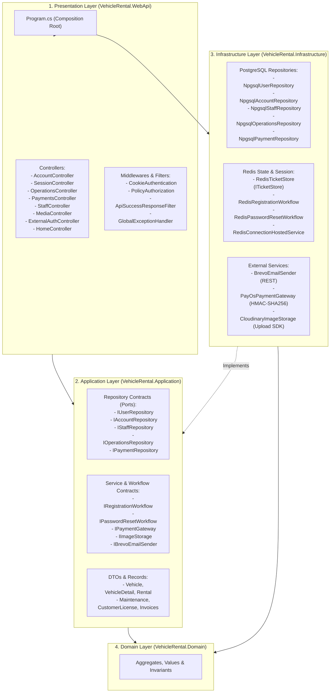
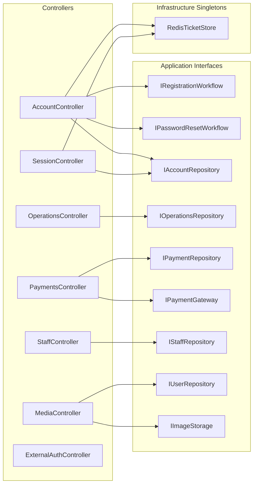

# Kiến trúc Hệ thống Car Rental System (Backend Architecture)

Tài liệu này được biên soạn dựa trên phân tích đồ thị mã nguồn thực tế bằng **CodeGraph** (776 nodes, 1,446 edges, 73 API routes). Đây là tài liệu quy chuẩn mô tả toàn bộ kiến trúc, ranh giới module, luồng dữ liệu và danh mục phụ thuộc của dự án.

---

## 1. Nguyên lý Kiến trúc Cốt lõi

Dự án được xây dựng theo phong cách **Clean Architecture (Onion Architecture)** dạng **Modular Monolith**, đảm bảo:
- **Nguyên tắc phụ thuộc một chiều (Dependency Inversion):**
  $$\text{Domain} \longleftarrow \text{Application} \longleftarrow \text{Infrastructure} \longleftarrow \text{WebApi}$$
- **Độc lập hạ tầng (Infrastructure Independence):** Lớp `Application` và `Domain` hoàn toàn độc lập với framework HTTP, ORM, cơ sở dữ liệu và thư viện bên ngoài.
- **Không sử dụng ORM nặng:** Sử dụng trực tiếp `NpgsqlDataSource` (ADO.NET) để kiểm soát 100% hiệu năng, transaction và câu lệnh SQL.
- **Chủ đích không dùng Khóa Ngoại vật lý (No Physical Foreign Keys):** Toàn vẹn tham chiếu logic do các Use Cases và Repositories đảm bảo.
- **Bảo mật Session:** Không sử dụng JWT Bearer; sử dụng Cookie Session kết hợp Redis Ticket Store để hỗ trợ thu hồi phiên đăng nhập tức thì.

---

## 2. Sơ đồ Kiến trúc Phân tầng (Architecture Layers)

---

## 3. Bản đồ Phụ thuộc (Dependency Injection & Call Graph)

Dưới đây là chi tiết phân giải phụ thuộc được thiết lập tại `Program.cs`:

### 3.1. Phụ thuộc của các Controllers

### 3.2. Cấu hình Vòng đời Dịch vụ (Service Lifetimes)

| Tên Service / Interface | Lớp Thực thi (Implementation) | Vòng đời (Lifetime) | Công dụng |
|---|---|---|---|
| `NpgsqlDataSource` | `NpgsqlDataSource.Create(...)` | **Singleton** | Connection pool kết nối cơ sở dữ liệu PostgreSQL |
| `IConnectionMultiplexer` | `ConnectionMultiplexer.Connect(...)` | **Singleton** | Quản lý socket kết nối Redis |
| `RedisTicketStore` | `RedisTicketStore` | **Singleton** | Lưu trữ ticket phiên đăng nhập Cookie vào Redis |
| `RedisConnectionHostedService` | `RedisConnectionHostedService` | **HostedService** | Kiểm tra liveness và độ trễ kết nối Redis khi khởi động |
| `IImageStorage` | `CloudinaryImageStorage` | **Singleton** | Xử lý tải ảnh lên Cloudinary (`avatars`, `vehicles`) |
| `IBrevoEmailSender` | `BrevoEmailSender` | **HttpClient/Transient**| Gửi email giao dịch OTP qua API Brevo |
| `IPaymentGateway` | `PayOsPaymentGateway` | **HttpClient/Transient**| Tích hợp tạo link thanh toán và xác thực webhook PayOS |
| `IUserRepository` | `NpgsqlUserRepository` | **Scoped** | Xử lý tài khoản user và khách hàng `customers` |
| `IAccountRepository` | `NpgsqlAccountRepository` | **Scoped** | Nạp quyền RBAC, cập nhật profile và đổi mật khẩu |
| `IStaffRepository` | `NpgsqlStaffRepository` | **Scoped** | Quản lý nhân viên, hồ sơ tài xế và phân quyền phòng ban |
| `IOperationsRepository` | `NpgsqlOperationsRepository` | **Scoped** | Điều phối toàn bộ hoạt động xe, thuê xe, bảo trì, thống kê |
| `IPaymentRepository` | `NpgsqlPaymentRepository` | **Scoped** | Quản lý hóa đơn `invoices`, thanh toán và hoàn cọc |
| `IRegistrationWorkflow` | `RedisRegistrationWorkflow` | **Scoped** | Quản lý OTP đăng ký tài khoản qua Redis |
| `IPasswordResetWorkflow` | `RedisPasswordResetWorkflow` | **Scoped** | Quản lý OTP quên mật khẩu qua Redis |

---

## 4. Kiến trúc Cơ sở Dữ liệu & Quy tắc Nghiệp vụ

### 4.1. Không sử dụng Khóa Ngoại vật lý (No Foreign Keys)
- Cơ sở dữ liệu cố ý bỏ các ràng buộc `FOREIGN KEY` để tránh lock cascading và tối ưu hóa tốc độ ghi.
- Tất cả các trường `*_id` (như `user_id`, `vehicle_id`, `rental_id`,...) là **khóa ngoại logic**.
- Tầng Application và Repository sử dụng `NpgsqlTransaction` để đảm bảo tính nguyên tử khi thêm/sửa đổi trên nhiều bảng liên quan.

### 4.2. Triggers Nghiệp vụ Bắt buộc (Database Triggers)
1. **Trigger `trg_invoice_no_subscription`**:  
   Chặn tuyệt đối việc tạo `invoices` cho đơn thuê theo gói (`is_subscription = true`). Đơn theo gói được trừ trực tiếp vào quota thời gian, không xuất hóa đơn tiền mặt.
2. **Trigger `trg_payment_match_rental`**:  
   Kiểm tra tính nhất quán giữa cờ `is_subscription_payment` trong bảng `payments` với trường `is_subscription` của đơn `rentals`.
3. **Check Constraint `ck_payments_invoice_rule`**:  
   Bắt buộc: `(is_subscription_payment AND invoice_id IS NULL) OR (NOT is_subscription_payment AND invoice_id IS NOT NULL)`.

---

## 5. Kiến trúc Bảo mật & Xác thực (Security & RBAC)

### 5.1. Cookie Session + Redis Ticket Store
- Cookie Name: `__Host-vehicle-rental`
- Cấu hình: `HttpOnly = true`, `SameSite = Lax`, `SecurePolicy = Always`.
- Cơ chế Session:
  1. Client gửi `POST /api/auth/login` với email và password.
  2. Xác minh hash mật khẩu qua PBKDF2/Argon2.
  3. Nạp danh sách roles từ `user_roles` gán vào `ClaimsPrincipal`.
  4. Serialize ticket và lưu vào Redis theo key `session:<guid>` kèm danh sách `user:sessions:<email>`.
  5. Trả về session key trong cookie cho client.
  6. Khi người dùng đổi mật khẩu hoặc gọi `POST /api/auth/logout-all`, toàn bộ ticket liên kết với email trong Redis sẽ bị xóa ngay lập tức.

### 5.2. Phân quyền RBAC (Role-Based Access Control)
Hệ thống có 5 nhóm quyền chính:
- `Customer`: Khách hàng thuê xe, mua gói, quản lý GPLX và hồ sơ cá nhân.
- `Staff`: Nhân viên vận hành, bàn giao kiểm tra xe (pre/post inspection), duyệt bằng lái, quản lý xe.
- `Driver`: Nhân viên kiêm tài xế, được gán vào các cuốc thuê có yêu cầu tài xế.
- `Maintenance`: Nhân viên kỹ thuật phụ trách bảo trì, sửa chữa xe.
- `Admin`: Toàn quyền quản trị nhân sự, tổ chức, danh mục, cấu hình và xem số liệu Dashboard.

Các Policy được đăng ký tại `Program.cs`:
- `RequireAdmin` ➔ Yêu cầu Role `Admin`.
- `RequireStaff` ➔ Yêu cầu Role `Admin` hoặc `Staff`.
- `RequireMaintenance` ➔ Yêu cầu Role `Admin`, `Staff` hoặc `Maintenance`.
- `RequireCustomer` ➔ Yêu cầu Role `Customer`.

---

## 6. Danh mục Chi tiết Tuyến API (73 API Routes)

### 6.1. Xác thực & Tài khoản (`AccountController`, `SessionController`, `ExternalAuthController`)
| Method | Endpoint | Quyền hạn | Mô tả |
|---|---|---|---|
| `POST` | `/api/account/registrations` | Public | Bắt đầu đăng ký (gửi mã OTP qua Brevo) |
| `POST` | `/api/account/registrations/verify` | Public | Xác thực OTP và khởi tạo tài khoản |
| `POST` | `/api/account/registrations/resend` | Public | Gửi lại mã OTP đăng ký |
| `POST` | `/api/account/password-resets` | Public | Bắt đầu quên mật khẩu (gửi OTP) |
| `POST` | `/api/account/password-resets/verify` | Public | Xác thực OTP và đặt mật khẩu mới |
| `GET` | `/api/account/profile` | Cookie Session | Lấy hồ sơ tài khoản hiện tại |
| `PUT` | `/api/account/profile` | Cookie Session | Cập nhật tên, giới tính, số điện thoại |
| `POST` | `/api/account/password` | Cookie Session | Đổi mật khẩu & thu hồi toàn bộ session |
| `POST` | `/api/auth/login` | Public | Đăng nhập tạo Cookie Session |
| `POST` | `/api/auth/logout` | Cookie Session | Đăng xuất thiết bị hiện tại |
| `POST` | `/api/auth/logout-all` | Cookie Session | Thu hồi session trên mọi thiết bị |
| `GET` | `/api/auth/google` | Public | Điều hướng đăng nhập Google OAuth |
| `GET` | `/api/auth/google/complete` | Cookie Session | Hoàn tất đăng nhập Google OAuth |

### 6.2. Phương tiện, Vận hành & Thuê xe (`OperationsController`, `MediaController`)
| Method | Endpoint | Quyền hạn | Mô tả |
|---|---|---|---|
| `GET` | `/api/customer/license` | Cookie Session | Xem GPLX của khách hàng |
| `PUT` | `/api/customer/license` | Cookie Session | Cập nhật GPLX chờ duyệt |
| `PUT` | `/api/customers/{customerId}/license-status`| `Admin,Staff` | Duyệt/từ chối GPLX (`approved`/`rejected`) |
| `GET` | `/api/vehicle-types` | Public | Danh sách phân loại xe |
| `POST` | `/api/vehicle-types` | `Admin,Staff` | Tạo loại xe mới |
| `PUT` | `/api/vehicle-types/{id}` | `Admin,Staff` | Chỉnh sửa loại xe |
| `DELETE`| `/api/vehicle-types/{id}` | `Admin` | Xóa loại xe |
| `GET` | `/api/vehicles` | Public | Tìm kiếm, lọc xe (thời gian, cơ sở, loại xe) |
| `GET` | `/api/vehicles/{id}` | Public | Chi tiết xe, cấu hình subtype & ảnh gallery |
| `POST` | `/api/vehicles` | `Admin,Staff` | Thêm xe mới (kèm chi tiết `Detail`) |
| `PUT` | `/api/vehicles/{id}` | `Admin,Staff` | Sửa thông tin xe và chi tiết |
| `POST` | `/api/media/avatar` | Cookie Session | Tải ảnh đại diện lên Cloudinary (tối đa 5MB) |
| `POST` | `/api/media/vehicle` | `Admin,Staff` | Tải ảnh xe lên Cloudinary (tối đa 10MB) |
| `GET` | `/api/departments` | `Admin` | Danh sách phòng ban |
| `POST` | `/api/departments` | `Admin` | Tạo phòng ban |
| `PUT` | `/api/departments/{id}` | `Admin` | Sửa phòng ban |
| `DELETE`| `/api/departments/{id}` | `Admin` | Xóa phòng ban |
| `GET` | `/api/facilities` | `Admin` | Danh sách cơ sở / chi nhánh |
| `POST` | `/api/facilities` | `Admin` | Tạo cơ sở |
| `PUT` | `/api/facilities/{id}` | `Admin` | Sửa cơ sở |
| `DELETE`| `/api/facilities/{id}` | `Admin` | Xóa cơ sở |
| `GET` | `/api/rental-policies` | `Admin,Staff` | Danh sách chính sách tính giá, VAT, cọc |
| `POST` | `/api/rental-policies` | `Admin,Staff` | Tạo chính sách giá |
| `PUT` | `/api/rental-policies/{id}` | `Admin,Staff` | Sửa chính sách giá |
| `POST` | `/api/rentals/hourly` | Cookie Session | Đặt thuê xe theo giờ |
| `POST` | `/api/rentals/longterm` | Cookie Session | Đặt thuê xe dài hạn |
| `GET` | `/api/rentals/{id}` | Cookie Session | Chi tiết đơn thuê xe |
| `POST` | `/api/rentals/{id}/status/{status}` | `Admin,Staff` | Chuyển đổi trạng thái đơn thuê |
| `POST` | `/api/rentals/{id}/assignments` | `Admin,Staff` | Gán tài xế cho chuyến thuê |
| `POST` | `/api/rentals/{id}/inspections/pre` | `Admin,Staff` | Bàn giao kiểm tra xe trước khi giao |
| `POST` | `/api/rentals/{id}/inspections/post` | `Admin,Staff` | Nhận lại xe sau thuê (tự kích hoạt hoàn cọc) |
| `GET` | `/api/subscription-plans` | Public | Danh sách gói hội viên mở bán |
| `GET` | `/api/subscription-plans/{id}` | Public | Chi tiết gói hội viên |
| `POST` | `/api/subscription-plans` | `Admin,Staff` | Thêm gói hội viên mới |
| `PUT` | `/api/subscription-plans/{id}` | `Admin,Staff` | Sửa gói hội viên |
| `DELETE`| `/api/subscription-plans/{id}` | `Admin` | Xóa/ngừng bán gói hội viên |
| `POST` | `/api/subscription-plans/{id}/purchase` | Cookie Session | Khách hàng đăng ký mua gói hội viên |
| `GET` | `/api/maintenance` | `Admin,Staff,Maintenance` | Danh sách lịch bảo trì xe |
| `POST` | `/api/maintenance` | `Admin,Staff,Maintenance` | Lập lịch bảo trì xe (gán NV và cơ sở) |
| `PUT` | `/api/maintenance/{id}` | `Admin,Staff,Maintenance` | Cập nhật bảo trì & xác nhận xe an toàn |
| `GET` | `/api/dashboard` | `Admin` | Thống kê: Doanh thu, Xe đang thuê, Bảo trì, Gói |

### 6.3. Thanh toán & Hóa đơn (`PaymentsController`)
| Method | Endpoint | Quyền hạn | Mô tả |
|---|---|---|---|
| `GET` | `/api/invoices` | Cookie Session | Lịch sử hóa đơn |
| `GET` | `/api/invoices/{invoiceId}` | Cookie Session | Chi tiết hóa đơn |
| `POST` | `/api/invoices/{invoiceId}/checkout` | Cookie Session | Tạo link thanh toán PayOS Checkout |
| `POST` | `/api/payments/webhooks/payos` | Public (Verified) | Webhook callback tự động quyết toán PayOS |
| `POST` | `/api/rentals/{rentalId}/invoice` | `Admin,Staff` | Tạo hóa đơn thủ công cho đơn thuê trực tiếp |
| `GET` | `/api/payments` | Cookie Session | Lịch sử giao dịch thanh toán / hoàn tiền |
| `POST` | `/api/payments/{paymentId}/refunds` | `Admin,Staff` | Yêu cầu hoàn tiền đặt cọc |
| `POST` | `/api/payments/refunds/{refundId}/approve`| `Admin` | Duyệt lệnh hoàn tiền |
| `POST` | `/api/payments/refunds/{refundId}/reject` | `Admin` | Từ chối lệnh hoàn tiền |

### 6.4. Quản lý Nhân sự & Tài xế (`StaffController`)
| Method | Endpoint | Quyền hạn | Mô tả |
|---|---|---|---|
| `GET` | `/api/staff` | `Admin` | Danh sách nhân viên toàn hệ thống (phân trang) |
| `GET` | `/api/staff/{id}` | `Admin` | Chi tiết nhân viên |
| `GET` | `/api/staff/drivers` | `Admin` | Danh sách riêng nhân viên làm tài xế lái xe |
| `POST` | `/api/staff` | `Admin` | Thêm nhân viên mới / tài xế |
| `PUT` | `/api/staff/{id}` | `Admin` | Cập nhật thông tin nhân viên / tài xế |
| `DELETE`| `/api/staff/{id}` | `Admin` | Vô hiệu hóa tài khoản nhân viên |

---

## 7. Giám sát & Vận hành (Observability & Health Checks)

- **Probe Endpoint:** `GET /health` trả về `200 OK` khi cả kết nối PostgreSQL và Redis hoạt động bình thường, trả về `503 Service Unavailable` khi mất kết nối.
- **Root Endpoint:** `GET /` tự động chuyển hướng đến `/swagger` trong môi trường Development và `/health` trong môi trường Production.
- **Console Logging:** Đã cấu hình SimpleConsole với định dạng timestamp chuẩn `yyyy-MM-dd HH:mm:ss`, không in các thông tin nhạy cảm (secrets, passwords, connection strings, OTP).
