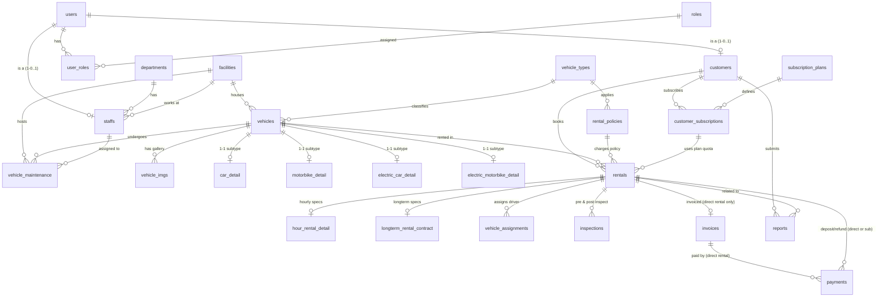

# Tài liệu Kỹ thuật Backend & Kiến trúc Cơ sở Dữ liệu cho Flutter Mobile
**Dự án:** Car Rental System (Nền tảng Quản trị & Cho thuê Phương tiện Giao thông)  
**Mục tiêu:** Cung cấp tài liệu kỹ thuật chuẩn xác, đầy đủ về Cơ sở dữ liệu và toàn bộ hệ thống API phục vụ phát triển ứng dụng di động Flutter.

---

## MỤC LỤC
1. [Tổng quan Kiến trúc Kết nối Mobile - Backend](#1-tổng-quan-kiến-trúc-kết-nối-mobile---backend)
2. [Cơ chế Xác thực & Session (Cookie-based Auth trên Mobile)](#2-cơ-chế-xác-thực--session-cookie-based-auth-trên-mobile)
3. [Chuẩn hóa Định dạng Dữ liệu (Request / Response / Error)](#3-chuẩn-hóa-định-dạng-dữ-liệu-request--response--error)
4. [Kiến trúc Cơ sở Dữ liệu PostgreSQL Hoàn chỉnh](#4-kiến-trúc-cơ-sở-dữ-liệu-postgresql-hoàn-chỉnh)
   - 4.1. [Sơ đồ Quan hệ Thực thể (ERD)](#41-sơ-đồ-quan-hệ-thực-thể-erd)
   - 4.2. [Từ điển Dữ liệu Chi tiết (Data Dictionary - 19+ Bảng)](#42-từ-điển-dữ-liệu-chi-tiết-data-dictionary)
   - 4.3. [Ràng buộc & Triggers Nghiệp vụ](#43-ràng-buộc--triggers-nghiệp-vụ)
5. [Đặc tả Chi tiết API Endpoints cho Mobile Client](#5-đặc-tả-chi-tiết-api-endpoints-cho-mobile-client)
   - 5.1. [Module Xác thực & Tài khoản (Auth & Accounts)](#51-module-xác-thực--tài-khoản-auth--accounts)
   - 5.2. [Module Hồ sơ & Giấy phép Lái xe (Profile & Driver License)](#52-module-hồ-sơ--giấy-phép-lái-xe-profile--driver-license)
   - 5.3. [Module Phương tiện & Danh mục (Vehicles & Media Upload)](#53-module-phương-tiện--danh-mục-vehicles--media-upload)
   - 5.4. [Module Thuê xe & Hợp đồng (Rentals & Inspections)](#54-module-thuê-xe--hợp-đồng-rentals--inspections)
   - 5.5. [Module Gói Thuê Hội viên (Subscription Plans)](#55-module-gói-thuê-hội-viên-subscription-plans)
   - 5.6. [Module Hóa đơn & Thanh toán (Invoices & PayOS Gateway)](#56-module-hóa-đơn--thanh-toán-invoices--payos-gateway)
   - 5.7. [Module Bảo trì & Vận hành (Maintenance & Dashboard)](#57-module-bảo-trì--vận-hành-maintenance--dashboard)
6. [Hướng dẫn Khởi tạo Dự án Flutter Mobile](#6-hướng-dẫn-khởi-tạo-dự-án-flutter-mobile)
   - 6.1. [Dependencies khuyến nghị (pubspec.yaml)](#61-dependencies-khuyến-nghị-pubspecyaml)
   - 6.2. [Cấu hình Network & Cookie Manager (Dio + CookieJar)](#62-cấu-hình-network--cookie-manager-dio--cookiejar)
   - 6.3. [Cấu hình Môi trường Mạng Android / iOS](#63-cấu-hình-môi-trường-mạng-android--ios)
   - 6.4. [Xử lý Thanh toán PayOS & Deep Link](#64-xử-lý-thanh-toán-payos--deep-link)

---

## 1. Tổng quan Kiến trúc Kết nối Mobile - Backend

### 1.1. Thông số Kỹ thuật Backend
- **Nền tảng:** .NET 8 Web API (Clean Architecture).
- **Môi trường cục bộ (Dev):** `http://localhost:6789` (Swagger: `http://localhost:6789/swagger`).
- **Địa chỉ gọi từ Thiết bị Mobile:**
  - **Android Emulator:** `http://10.0.2.2:6789`
  - **iOS Simulator:** `http://127.0.0.1:6789` hoặc `http://localhost:6789`
  - **Thiết bị thật (Physical Device):** `http://<IP_LAN_MAY_TINH>:6789` (VD: `http://192.168.1.15:6789`)
- **Dịch vụ lưu trữ tệp (Ảnh):** Cloudinary (Media API proxy qua BE).
- **Cổng thanh toán:** PayOS (Merchant Hosted Checkout / Webhook).

---

## 2. Cơ chế Xác thực & Session (Cookie-based Auth trên Mobile)

Hệ thống **không sử dụng JWT Bearer Token** mà sử dụng **ASP.NET Core Cookie Session kết hợp Redis Ticket Store** (bảo mật cao, chống đánh cắp token, hỗ trợ thu hồi tức thì):
- Tên Cookie: `__Host-vehicle-rental`
- Thuộc tính Cookie: `HttpOnly=true`, `SameSite=Lax`, `SecurePolicy=Always` (hoặc `SameAsRequest` trên dev).
- Thời hạn: Sliding Expiration (mặc định 8 giờ, gia hạn khi hoạt động; tối đa 24 giờ).
- Thu hồi phiên: Gọi `POST /api/auth/logout` hoặc `POST /api/auth/logout-all` (xóa ticket trong Redis).

### Lưu ý cho Flutter:
Flutter không tự động lưu cookie giữa các request như trình duyệt. Bạn **bắt buộc** phải dùng thư viện quản lý Cookie như `dio_cookie_manager` kết hợp `cookie_jar` hoặc `persisted_cookie_jar` để cookie tự động gửi kèm trong Header `Cookie: __Host-vehicle-rental=...` ở các request tiếp theo.

---

## 3. Chuẩn hóa Định dạng Dữ liệu (Request / Response / Error)

### 3.1. Response Thành công chuẩn (ApiSuccessResponse<T>)
Hầu hết các API trả về cấu trúc bọc dữ liệu sau:
```json
{
  "is_success": true,
  "message": "Service is healthy.",
  "data": { ... }
}
```

### 3.2. Response Lỗi chuẩn (ProblemDetails - RFC 7807)
Khi có lỗi xác thực (400), quyền hạn (401/403), không tìm thấy (404), xung đột (409) hoặc hệ thống (500):
```json
{
  "type": "https://tools.ietf.org/html/rfc9110#section-15.5.1",
  "title": "Bad Request",
  "status": 400,
  "detail": "License must not be expired."
}
```
Khi lỗi Validate Model (ValidationProblem):
```json
{
  "type": "https://tools.ietf.org/html/rfc9110#section-15.5.1",
  "title": "One or more validation errors occurred.",
  "status": 400,
  "errors": {
    "Email": ["The Email field is required."],
    "Password": ["The field Password must be a string with a minimum length of 6."]
  }
}
```

---

## 4. Kiến trúc Cơ sở Dữ liệu PostgreSQL Hoàn chỉnh

> **Quy tắc Kiến trúc Hệ thống:**  
> Hệ thống **cố ý không định nghĩa Khóa Ngoại vật lý (NO FOREIGN KEY CONSTRAINTS)** ở tầng Database để tăng hiệu năng ghi và phân mảnh ngang.  
> **Mọi quan hệ logic được kiểm soát và bảo toàn tính toàn vẹn ở tầng Application & Domain Services.**

### 4.1. Sơ đồ Quan hệ Thực thể (ERD)



---

### 4.2. Từ điển Dữ liệu Chi tiết (Data Dictionary)

#### Nhóm 1: Người dùng & Tổ chức (Identity & Organization)

##### Bảng `users`
Lưu trữ tài khoản xác thực chung (khách hàng, nhân viên, quản trị viên).
| Cột | Kiểu dữ liệu | Ràng buộc | Mô tả |
|---|---|---|---|
| `id` | INTEGER | PK, IDENTITY | Mã định danh người dùng |
| `email` | VARCHAR(255) | NOT NULL, UNIQUE INDEX | Email duy nhất (chữ thường) |
| `fullname` | VARCHAR(255) | NULL | Họ và tên hiển thị |
| `gender` | VARCHAR(255) | NULL | Giới tính (`Male`, `Female`, `Other`) |
| `password_hash`| VARCHAR(255) | NULL | Hash mật khẩu (PBKDF2/Argon2 kèm salt) |
| `avatar` | VARCHAR(255) | NULL | URL ảnh đại diện trên Cloudinary |
| `phone` | VARCHAR(255) | NULL | Số điện thoại liên hệ |
| `is_active` | BOOLEAN | NOT NULL, DEFAULT TRUE | Trạng thái hoạt động |
| `created_at` | TIMESTAMP | NOT NULL, DEFAULT now()| Ngày tạo tài khoản |

##### Bảng `roles` & `user_roles`
Phân quyền RBAC.
- `roles`: `id` (PK), `name` (VARCHAR - `Customer`, `Staff`, `Admin`, `Driver`, `Maintenance`).
- `user_roles`: `id` (PK), `user_id` (Logic FK -> `users.id`), `role_id` (Logic FK -> `roles.id`).

##### Bảng `departments` & `facilities`
- `departments`: `id` (PK), `name` (VARCHAR - Tên phòng ban).
- `facilities`: `id` (PK), `name` (VARCHAR - Tên cơ sở/chi nhánh), `address` (VARCHAR - Địa chỉ cơ sở).

##### Bảng `staffs`
Nhân viên công ty (kế thừa `users`, quan hệ 1-1).
| Cột | Kiểu dữ liệu | Ràng buộc | Mô tả |
|---|---|---|---|
| `id` | INTEGER | PK, IDENTITY | Mã nhân viên |
| `user_id` | INTEGER | NOT NULL, UNIQUE INDEX | Trỏ tới `users.id` |
| `department_id` | INTEGER | NULL | Trỏ tới `departments.id` |
| `facility_id` | INTEGER | NULL | Cơ sở làm việc trỏ tới `facilities.id` |
| `hired_date` | DATE | NULL | Ngày vào làm |
| `is_driver` | BOOLEAN | NOT NULL, DEFAULT FALSE | Đánh dấu nhân viên kiêm tài xế lái xe |
| `license_number` | VARCHAR(255) | NULL | Số bằng lái xe của tài xế |
| `license_type` | VARCHAR(255) | NULL | Hạng bằng lái (`B1`, `B2`, `C`,...) |
| `license_issue_date` | DATE | NULL | Ngày cấp bằng lái |
| `license_expiry_date`| DATE | NULL | Ngày hết hạn bằng lái |
| `license_img` | VARCHAR(255) | NULL | URL ảnh bằng lái |
| `rating` | NUMERIC(3,2) | NULL | Điểm đánh giá chất lượng tài xế (1.00 - 5.00) |

##### Bảng `customers`
Khách hàng thuê xe (kế thừa `users`, quan hệ 1-1).
| Cột | Kiểu dữ liệu | Ràng buộc | Mô tả |
|---|---|---|---|
| `id` | INTEGER | PK, IDENTITY | Mã khách hàng |
| `user_id` | INTEGER | NOT NULL, UNIQUE INDEX | Trỏ tới `users.id` |
| `license_number` | VARCHAR(255) | NULL | Số giấy phép lái xe |
| `license_type` | VARCHAR(255) | NULL | Hạng bằng lái xe |
| `license_issue_date` | DATE | NULL | Ngày cấp |
| `license_expiry_date`| DATE | NULL | Ngày hết hạn |
| `license_img` | VARCHAR(255) | NULL | URL ảnh mặt trước bằng lái |
| `license_status` | VARCHAR(20) | DEFAULT 'pending' | Trạng thái duyệt: `pending`, `approved`, `rejected` |
| `loyalty_point` | INTEGER | NOT NULL, DEFAULT 0 | Điểm tích lũy thành viên |

---

#### Nhóm 2: Phương tiện & Phân loại (Catalog & Vehicles)

##### Bảng `vehicle_types`
- `id` (PK), `name` (Tên loại: Ô tô Sedan, SUV, Xe máy tay ga,...), `fuel_type` (`Gasoline`, `Diesel`, `Electric`).

##### Bảng `vehicles`
Thông tin xe cốt lõi.
| Cột | Kiểu dữ liệu | Ràng buộc | Mô tả |
|---|---|---|---|
| `id` | INTEGER | PK, IDENTITY | Mã định danh xe |
| `vehicle_type_id` | INTEGER | NOT NULL | Trỏ tới `vehicle_types.id` |
| `facility_id` | INTEGER | NULL | Cơ sở hiện tại chứa xe (`facilities.id`) |
| `status` | VARCHAR(255) | NULL | `available`, `renting`, `maintenance`, `reserved` |
| `brand` | VARCHAR(255) | NULL | Hãng xe (Toyota, Honda, VinFast,...) |
| `model` | VARCHAR(255) | NULL | Dòng xe (Camry, VF8, SH 150i,...) |
| `color` | VARCHAR(255) | NULL | Màu sắc |
| `year_of_manufacture`| INTEGER | NULL | Năm sản xuất |
| `rental_price_hourly` | NUMERIC(14,2)| NULL | Giá thuê lẻ theo giờ (VNĐ) |
| `rental_price_longterm`| NUMERIC(14,2)| NULL | Giá thuê dài hạn theo tháng (VNĐ) |
| `description` | VARCHAR(255) | NULL | Mô tả tổng quan |
| `main_img_url` | VARCHAR(255) | NULL | Ảnh đại diện chính |
| `current_location` | VARCHAR(255) | NULL | Vị trí định vị / địa chỉ hiện tại |
| `is_renting` | BOOLEAN | NOT NULL, DEFAULT FALSE | Cờ trạng thái đang lăn bánh phục vụ |

##### Bảng `vehicle_imgs` (Bộ sưu tập ảnh xe)
- `id` (PK), `vehicle_id` (Logic FK -> `vehicles.id`), `url` (VARCHAR - URL ảnh chi tiết).

##### Các bảng Subtype chi tiết phương tiện (Quan hệ 1-1 với `vehicles.id`)
- `car_detail`: `vehicle_id` (PK), `seat_count` (Số chỗ ngồi: 4, 5, 7), `transmission` (`Automatic`, `Manual`), `trunk_capacity` (Dung tích cốp - Lít).
- `motorbike_detail`: `vehicle_id` (PK), `bike_type` (Tay ga, Xe số, Côn tay), `has_storage_box` (Có thùng đồ phụ hay không).
- `electric_car_detail` & `electric_motorbike_detail`: `vehicle_id` (PK), `battery_capacity` (kWh), `charging_type` (AC/DC/Type 2), `charging_time_hours`, `max_range_km` (Quãng đường tối đa mỗi lần sạc), `battery_type` (LFP, Li-ion).

---

#### Nhóm 3: Chính sách & Gói Hội viên (Policies & Subscriptions)

##### Bảng `rental_policies`
- `id` (PK), `vehicle_type_id` (NULL áp dụng chung), `name`, `vat_rate` (% thuế VAT, mặc định 10%), `overtime_fee_rate` (% phí quá giờ/h), `deposit_percentage` (% tiền cọc yêu cầu, vd: 20%), `is_active` (BOOLEAN).

##### Bảng `subscription_plans`
- `id` (PK), `name` (Tên gói, vd: Gói Doanh nhân, Gói Tháng Tiết kiệm), `description`, `price` (Giá mua gói), `duration_days` (Số ngày hiệu lực gói, vd: 30), `included_hours` (Số giờ thuê xe được bao gồm trong gói), `is_active`.

##### Bảng `customer_subscriptions`
Gói dịch vụ mà khách hàng đã mua và đang sở hữu.
- `id` (PK), `customer_id` (`customers.id`), `plan_id` (`subscription_plans.id`), `status` (`active`, `expired`, `exhausted`), `start_date`, `end_date`, `remaining_hours` (Số giờ còn lại để khấu trừ khi thuê).

---

#### Nhóm 4: Đơn thuê, Kiểm tra & Giao xe (Rentals & Operations)

##### Bảng `rentals`
Đơn đặt thuê xe.
| Cột | Kiểu dữ liệu | Ràng buộc | Mô tả |
|---|---|---|---|
| `id` | INTEGER | PK, IDENTITY | Mã đơn thuê |
| `customer_id` | INTEGER | NOT NULL | Khách hàng thuê (`customers.id`) |
| `vehicle_id` | INTEGER | NOT NULL | Xe được thuê (`vehicles.id`) |
| `policy_id` | INTEGER | NULL | Chính sách giá áp dụng (`rental_policies.id`) |
| `customer_subscription_id`| INTEGER | NULL | Gói hội viên sử dụng (nếu thuê bằng gói) |
| `is_subscription` | BOOLEAN | NOT NULL | `true` nếu thuê bằng gói, `false` nếu thuê trực tiếp |
| `rental_type` | VARCHAR(20) | CHECK ('hourly', 'longterm') | Loại thuê |
| `status` | VARCHAR(255) | NOT NULL | Vòng đời: `pending` ➔ `pre_inspection` ➔ `renting` ➔ `post_inspection` ➔ `completed` (hoặc `cancelled`) |
| `vat_price` | NUMERIC(14,2)| DEFAULT 0 | Tiền thuế VAT |
| `deposit_price` | NUMERIC(14,2)| DEFAULT 0 | Tiền đặt cọc giữ xe |
| `overtime_price`| NUMERIC(14,2)| DEFAULT 0 | Phí phụ thu quá giờ |
| `total_price` | NUMERIC(14,2)| DEFAULT 0 | Tổng giá trị đơn thuê (chưa gồm cọc hoàn lại) |
| `created_at` | TIMESTAMP | DEFAULT now() | Ngày tạo đơn |

##### Bảng `hour_rental_detail` & `longterm_rental_contract` (Chi tiết theo loại thuê)
- `hour_rental_detail`: `rental_id` (PK), `start_time`, `end_time`, `has_driver` (Thuê kèm tài xế), `hourly_price_snapshot` (Giá giờ tại thời điểm chốt đơn), `pickup_location`, `pick_up_method`, `staff_pickup_id`.
- `longterm_rental_contract`: `rental_id` (PK), `start_time`, `end_time`, `monthly_price_snapshot`, `contract_link` (File hợp đồng ký điện tử), `signed_at`.

##### Bảng `vehicle_assignments` (Phân công tài xế)
- `id` (PK), `rental_id`, `vehicle_id`, `driver_staff_id` (`staffs.id`, NULL nếu khách tự lái), `status` (`assigned`, `in_progress`, `completed`).

##### Bảng `inspections` (Kiểm tra xe trước và sau thuê)
- `id` (PK), `rental_id`, `vehicle_id`, `staff_id`, `inspection_type` (`pre_rental` hoặc `post_rental`), `is_ok` (Xe đạt chuẩn hay có lỗi), `odometer_km` (Số công-tơ-mét), `fuel_battery_level` (% xăng/pin còn lại), `damage_notes` (Ghi chú trầy xước hỏng hóc), `img_urls` (Danh sách URL ảnh chụp hiện trạng xe).

---

#### Nhóm 5: Hóa đơn & Thanh toán (Billing & Payments)

##### Bảng `invoices` (Hóa đơn - Chỉ tạo khi thuê trực tiếp, KHÔNG tạo khi thuê qua Subscription)
- `id` (PK), `rental_id` (NOT NULL), `invoice_number` (`INV-YYYYMMDD-ID`), `amount` (Tổng thanh toán = Tiền thuê + VAT + Tiền cọc), `vat_amount`, `status` (`unpaid`, `paid`, `cancelled`), `issued_at`, `due_at`.

##### Bảng `payments` (Lịch sử giao dịch thanh toán & hoàn cọc)
- `id` (PK), `rental_id`, `invoice_id` (NULL nếu thanh toán thuê qua gói), `customer_id`, `is_subscription_payment` (BOOLEAN), `amount`, `status` (`pending`, `paid`, `failed`, `requested` - cho hoàn cọc, `refunded`), `type` (`deposit`, `rental`, `overtime`, `refund`), `method` (`payos`, `cash`, `deposit`), `provider_reference` (Mã giao dịch từ PayOS), `paid_at`, `reviewed_by`, `reviewed_at`.

---

#### Nhóm 6: Bảo trì & Báo cáo sự cố (Maintenance & Reports)

##### Bảng `vehicle_maintenance`
- `id` (PK), `vehicle_id`, `facility_id` (Cơ sở bảo trì), `assigned_staff_id` (Nhân viên kỹ thuật phụ trách), `rental_id` (Liên quan nếu phát sinh trong chuyến đi), `inspection_id` (Nếu phát sinh từ lúc bàn giao xe không đạt), `status` (`open`, `in_progress`, `completed`, `cancelled`), `maintenance_type` (`routine`, `inspection`, `repair`, `emergency`), `scheduled_date`, `is_safe` (Đã an toàn để cho thuê lại hay chưa), `description`, `cost` (Chi phí sửa chữa).

##### Bảng `reports` (Khách phản ánh / sự cố)
- `id` (PK), `customer_id`, `rental_id`, `maintenance_id`, `type`, `description`, `status` (`open`, `resolved`), `created_at`.

---

### 4.3. Ràng buộc & Triggers Nghiệp vụ

1. **Trigger `trg_invoice_no_subscription`**:  
   Chặn tuyệt đối hành vi tạo hoặc cập nhật bản ghi vào bảng `invoices` nếu `rentals.is_subscription = true`. Thuê qua gói hội viên đã được trừ vào quota gói, không phát sinh hóa đơn tiền mặt.
2. **Trigger `trg_payment_match_rental`**:  
   Đảm bảo cờ `is_subscription_payment` trong `payments` phải khớp 100% với `is_subscription` của đơn `rentals` tương ứng.
3. **CHECK `ck_payments_invoice_rule`**:  
   Nếu thanh toán thuê qua gói: `invoice_id` bắt buộc phải là `NULL`. Nếu thuê trực tiếp: `invoice_id` bắt buộc phải khác `NULL`.

---

## 5. Đặc tả Chi tiết API Endpoints cho Mobile Client

### 5.1. Module Xác thực & Tài khoản (Auth & Accounts)

#### `POST /api/account/registrations` — Bắt đầu đăng ký tài khoản (Gửi OTP)
- **Auth:** Public.
- **Request Body:**
  ```json
  {
    "email": "customer@example.com",
    "fullName": "Nguyễn Văn A",
    "password": "Password123!"
  }
  ```
- **Response (202 Accepted):** OTP 6 số đã được gửi qua email.

#### `POST /api/account/registrations/verify` — Xác thực OTP hoàn tất đăng ký
- **Auth:** Public.
- **Request Body:**
  ```json
  {
    "email": "customer@example.com",
    "otp": "123456"
  }
  ```
- **Response (201 Created):** Tài khoản được tạo, gán quyền `Customer`.

#### `POST /api/account/registrations/resend` — Gửi lại mã OTP
- **Auth:** Public.
- **Request Body:** `{ "email": "customer@example.com" }`

#### `POST /api/auth/login` — Đăng nhập hệ thống (Thiết lập Cookie Session)
- **Auth:** Public.
- **Request Body:**
  ```json
  {
    "email": "customer@example.com",
    "password": "Password123!",
    "rememberMe": true
  }
  ```
- **Response Header:** `Set-Cookie: __Host-vehicle-rental=<TICKET_KEY>; path=/; HttpOnly; SameSite=Lax`
- **Response (204 No Content):** Đăng nhập thành công.

#### `POST /api/auth/logout` — Đăng xuất thiết bị hiện tại
- **Auth:** Cookie Session (`[Authorize]`).
- **Response (204 No Content).**

#### `POST /api/auth/logout-all` — Đăng xuất khỏi mọi thiết bị (Thu hồi toàn bộ session)
- **Auth:** Cookie Session (`[Authorize]`).
- **Response (204 No Content):** Xóa toàn bộ ticket trong Redis.

#### `POST /api/account/password-resets` — Yêu cầu quên mật khẩu
- **Auth:** Public.
- **Request Body:** `{ "email": "customer@example.com" }`

#### `POST /api/account/password-resets/verify` — Xác thực OTP & Đổi mật khẩu mới
- **Auth:** Public.
- **Request Body:**
  ```json
  {
    "email": "customer@example.com",
    "otp": "123456",
    "newPassword": "NewPassword123!"
  }
  ```

---

### 5.2. Module Hồ sơ & Giấy phép Lái xe (Profile & Driver License)

#### `GET /api/account/profile` — Lấy thông tin tài khoản hiện tại
- **Auth:** Cookie Session (`[Authorize]`).
- **Response (200 OK):**
  ```json
  {
    "email": "customer@example.com",
    "fullName": "Nguyễn Văn A",
    "gender": "Male",
    "phone": "0987654321",
    "avatarUrl": "https://res.cloudinary.com/.../avatar.jpg",
    "roles": ["Customer"]
  }
  ```

#### `PUT /api/account/profile` — Cập nhật thông tin cá nhân
- **Auth:** Cookie Session.
- **Request Body:**
  ```json
  {
    "fullName": "Nguyễn Văn B",
    "gender": "Male",
    "phone": "0912345678"
  }
  ```

#### `POST /api/account/password` — Đổi mật khẩu khi đang đăng nhập
- **Auth:** Cookie Session.
- **Request Body:**
  ```json
  {
    "currentPassword": "OldPassword123!",
    "newPassword": "NewPassword123!"
  }
  ```
*(Hệ thống sẽ cập nhật mật khẩu, thu hồi các phiên đăng nhập khác và đăng xuất).*

#### `POST /api/media/avatar` — Tải lên ảnh đại diện
- **Auth:** Cookie Session.
- **Content-Type:** `multipart/form-data`
- **Body Form:** `file`: [Binary Image File - Tối đa 5 MB]
- **Response (200 OK):** `{ "publicId": "...", "secureUrl": "https://..." }`

#### `GET /api/customer/license` — Xem thông tin GPLX của khách hàng
- **Auth:** Cookie Session.
- **Response (200 OK):**
  ```json
  {
    "number": "012345678999",
    "type": "B2",
    "issueDate": "2022-01-15",
    "expiryDate": "2032-01-15",
    "imageUrl": "https://res.cloudinary.com/.../license.jpg",
    "status": "pending"
  }
  ```
*(Trạng thái `status`: `pending`, `approved`, `rejected`). Khách hàng chỉ được phép thuê xe tự lái khi `status == "approved"`.*

#### `PUT /api/customer/license` — Cập nhật thông tin giấy phép lái xe
- **Auth:** Cookie Session.
- **Request Body:**
  ```json
  {
    "number": "012345678999",
    "type": "B2",
    "issueDate": "2022-01-15",
    "expiryDate": "2032-01-15",
    "imageUrl": "https://res.cloudinary.com/.../license.jpg"
  }
  ```
*(Ngày hết hạn `expiryDate` bắt buộc phải lớn hơn thời điểm hiện tại).*

---

### 5.3. Module Phương tiện & Danh mục (Vehicles & Media Upload)

#### `GET /api/vehicle-types` — Danh sách phân loại xe
- **Auth:** Public.
- **Response (200 OK):**
  ```json
  [
    { "id": 1, "name": "Ô tô 4-5 chỗ", "fuelType": "Gasoline" },
    { "id": 2, "name": "Xe máy điện", "fuelType": "Electric" }
  ]
  ```

#### `GET /api/vehicles` — Tìm kiếm & lọc danh sách xe cho thuê
- **Auth:** Public.
- **Query Parameters:**
  - `vehicleTypeId` (int, optional): Lọc theo loại xe.
  - `facilityId` (int, optional): Lọc theo cơ sở/chi nhánh nhận xe.
  - `status` (string, optional): Thường là `available`.
  - `from` (ISO DateTime, optional): Ngày giờ bắt đầu thuê (vd: `2026-10-10T08:00:00Z`).
  - `to` (ISO DateTime, optional): Ngày giờ kết thúc thuê. *(Nếu truyền `from` và `to`, hệ thống sẽ tự loại trừ các xe đã có lịch thuê trùng lặp)*.
  - `page` (int, default 1), `pageSize` (int, default 20, max 100).
- **Response (200 OK):**
  ```json
  {
    "items": [
      {
        "id": 10,
        "vehicleTypeId": 1,
        "vehicleType": "Ô tô 4-5 chỗ",
        "facilityId": 1,
        "facility": "Chi nhánh Cầu Giấy",
        "status": "available",
        "brand": "Toyota",
        "model": "Camry 2.5Q",
        "color": "Đen",
        "yearOfManufacture": 2024,
        "hourlyPrice": 120000.0,
        "longtermPrice": 22000000.0,
        "description": "Nội thất da cao cấp, cửa sổ trời",
        "mainImageUrl": "https://res.cloudinary.com/.../camry.jpg",
        "location": "Tầng hầm B2, Keangnam",
        "detail": null
      }
    ],
    "page": 1,
    "pageSize": 20,
    "totalCount": 1
  }
  ```

#### `GET /api/vehicles/{id}` — Xem chi tiết xe, cấu hình subtype & bộ sưu tập ảnh
- **Auth:** Public.
- **Response (200 OK):**
  ```json
  {
    "id": 10,
    "vehicleTypeId": 1,
    "vehicleType": "Ô tô 4-5 chỗ",
    "facilityId": 1,
    "facility": "Chi nhánh Cầu Giấy",
    "status": "available",
    "brand": "Toyota",
    "model": "Camry 2.5Q",
    "color": "Đen",
    "yearOfManufacture": 2024,
    "hourlyPrice": 120000.0,
    "longtermPrice": 22000000.0,
    "description": "Nội thất da cao cấp, cửa sổ trời",
    "mainImageUrl": "https://res.cloudinary.com/.../main.jpg",
    "location": "Tầng hầm B2, Keangnam",
    "detail": {
      "seatCount": 5,
      "transmission": "Automatic",
      "trunkCapacity": 480.0,
      "bikeType": null,
      "hasStorageBox": null,
      "batteryCapacity": null,
      "chargingType": null,
      "chargingTimeHours": null,
      "maxRangeKm": null,
      "batteryType": null,
      "galleryImages": [
        "https://res.cloudinary.com/.../side.jpg",
        "https://res.cloudinary.com/.../interior.jpg"
      ]
    }
  }
  ```

#### `POST /api/media/vehicle` — Tải lên ảnh xe (Dành cho Quản lý / Staff)
- **Auth:** `[Authorize(Roles = "Admin,Staff")]`.
- **Content-Type:** `multipart/form-data` (File tối đa 10 MB).

---

### 5.4. Module Thuê xe & Hợp đồng (Rentals & Inspections)

#### `GET /api/rental-policies` — Xem danh sách chính sách thuê (VAT, cọc, phạt quá giờ)
- **Auth:** Cookie Session.
- **Response (200 OK):**
  ```json
  [
    {
      "id": 1,
      "vehicleTypeId": null,
      "name": "Chính sách tiêu chuẩn",
      "vatRate": 10.0,
      "overtimeFeeRate": 15.0,
      "depositPercentage": 20.0,
      "isActive": true
    }
  ]
  ```

#### `POST /api/rentals/hourly` — Đặt thuê xe theo giờ (Khách hàng)
- **Auth:** Cookie Session.
- **Request Body:**
  ```json
  {
    "vehicleId": 10,
    "policyId": 1,
    "startTime": "2026-10-15T08:00:00Z",
    "endTime": "2026-10-15T18:00:00Z",
    "subscriptionId": null,
    "hasDriver": false
  }
  ```
  *(Nếu khách hàng tự lái `hasDriver: false` và không dùng gói hội viên, hệ thống kiểm tra bắt buộc giấy phép lái xe phải ở trạng thái `approved`)*.
- **Response (201 Created):**
  ```json
  {
    "id": 105,
    "customerId": 2,
    "vehicleId": 10,
    "rentalType": "hourly",
    "status": "pending",
    "isSubscription": false,
    "vatPrice": 120000.0,
    "depositPrice": 240000.0,
    "overtimePrice": 0.0,
    "totalPrice": 1320000.0,
    "startTime": "2026-10-15T08:00:00Z",
    "endTime": "2026-10-15T18:00:00Z"
  }
  ```
  *(Sau khi gọi API này thành công, hệ thống tự động sinh 1 hóa đơn `invoices` chờ thanh toán cọc/tiền thuê)*.

#### `POST /api/rentals/longterm` — Đăng ký thuê dài hạn (Theo tháng)
- **Auth:** Cookie Session.
- **Request Body:** Tương tự như thuê theo giờ nhưng `hasDriver` luôn là `false`.

#### `GET /api/rentals/{id}` — Xem chi tiết đơn thuê
- **Auth:** Cookie Session.
- **Response (200 OK):** Thông tin đơn thuê, trạng thái, thời gian bắt đầu/kết thúc.

#### `POST /api/rentals/{id}/inspections/pre` & `post` — Bàn giao kiểm tra xe
- **Auth:** `[Authorize(Roles = "Admin,Staff")]`.
- **Request Body:**
  ```json
  {
    "staffId": 1,
    "isOk": true,
    "odometerKm": 15420.5,
    "fuelBatteryLevel": 95.0,
    "damageNotes": "Không trầy xước",
    "imageUrls": "https://.../inspect1.jpg,https://.../inspect2.jpg"
  }
  ```
*(Khi kiểm tra trả xe `post_rental` thành công và `isOk: true`, hệ thống tự động kích hoạt tạo yêu cầu hoàn cọc trong `payments`)*.

---

### 5.5. Module Gói Thuê Hội viên (Subscription Plans)

#### `GET /api/subscription-plans` — Danh sách gói hội viên
- **Auth:** Public.
- **Query:** `all=false` (chỉ lấy gói đang mở bán).
- **Response (200 OK):**
  ```json
  [
    {
      "id": 1,
      "name": "Gói Khám Phá 50 Giờ",
      "description": "Dành cho khách đi công tác định kỳ",
      "price": 4500000.0,
      "durationDays": 30,
      "includedHours": 50.0,
      "isActive": true
    }
  ]
  ```

#### `POST /api/subscription-plans/{id}/purchase` — Đăng ký mua gói hội viên
- **Auth:** Cookie Session (`[Authorize]`).
- **Response (201 Created):** `{ "id": 12 }` (Mã `customer_subscriptions.id`). Khách hàng có thể dùng mã này để truyền vào `subscriptionId` khi thuê xe.

---

### 5.6. Module Hóa đơn & Thanh toán (Invoices & PayOS Gateway)

#### `GET /api/invoices` — Lịch sử hóa đơn của khách hàng
- **Auth:** Cookie Session (`[Authorize]`).
- **Response (200 OK):**
  ```json
  [
    {
      "id": 55,
      "invoiceNumber": "INV-20261015-105",
      "amount": 1560000.0,
      "status": "unpaid",
      "issuedAt": "2026-10-15T08:05:00Z"
    }
  ]
  ```

#### `POST /api/invoices/{invoiceId}/checkout` — Tạo liên kết thanh toán PayOS
- **Auth:** Cookie Session (`[Authorize]`).
- **Response (200 OK):**
  ```json
  {
    "orderCode": 55,
    "paymentUrl": "https://pay.payos.vn/web/...",
    "qrCode": "vietqr://...",
    "status": "PENDING"
  }
  ```
> **Luồng Mobile:**  
> App mở `paymentUrl` bằng `InAppWebView` hoặc `url_launcher`. Khi khách hàng chuyển khoản thành công, PayOS gọi Webhook tự động cập nhật đơn sang `paid` và chuyển hướng về `returnUrl`.

---

### 5.7. Module Bảo trì & Vận hành (Maintenance & Dashboard)

#### `GET /api/maintenance` — Danh sách lịch bảo trì xe
- **Auth:** `[Authorize(Roles = "Admin,Staff,Maintenance")]`.
- **Query Parameters:** `vehicleId` (optional), `status` (optional: `open`, `in_progress`, `completed`).
- **Response (200 OK):**
  ```json
  [
    {
      "id": 12,
      "vehicleId": 10,
      "facilityId": 1,
      "assignedStaffId": 3,
      "status": "open",
      "maintenanceType": "routine",
      "scheduledDate": "2026-10-20",
      "isSafe": false,
      "description": "Bảo dưỡng định kỳ 20,000 km",
      "cost": 1500000.0
    }
  ]
  ```

#### `POST /api/maintenance` — Tạo lịch bảo trì (gán nhân viên và cơ sở)
- **Auth:** `[Authorize(Roles = "Admin,Staff,Maintenance")]`.
- **Request Body:**
  ```json
  {
    "vehicleId": 10,
    "facilityId": 1,
    "assignedStaffId": 3,
    "status": "open",
    "maintenanceType": "repair",
    "scheduledDate": "2026-10-20",
    "isSafe": false,
    "description": "Thay má phanh trước",
    "cost": 850000.0
  }
  ```

#### `GET /api/dashboard` — Số liệu tổng quan Dashboard (Dành cho Quản trị viên)
- **Auth:** `[Authorize(Roles = "Admin")]`.
- **Response (200 OK):**
  ```json
  {
    "revenue": 45000000.0,
    "renting": 5,
    "maintenance": 2,
    "activeSubscriptions": 8
  }
  ```

---

## 6. Hướng dẫn Khởi tạo Dự án Flutter Mobile

### 6.1. Dependencies khuyến nghị (`pubspec.yaml`)

```yaml
name: car_rental_mobile
description: Car Rental System Mobile Application for Customers & Staff
publish_to: "none"
version: 1.0.0+1

environment:
  sdk: ">=3.3.0 <4.0.0"

dependencies:
  flutter:
    sdk: flutter
  
  # Quản lý mạng & Cookie Session
  dio: ^5.7.0
  cookie_jar: ^4.0.8
  dio_cookie_manager: ^3.1.1
  path_provider: ^2.1.4

  # Quản lý State & Dependency Injection
  flutter_riverpod: ^2.6.1 # hoặc flutter_bloc: ^8.1.6
  
  # Điều hướng màn hình
  go_router: ^14.3.2

  # Lưu trữ cục bộ bảo mật
  flutter_secure_storage: ^9.2.2

  # Mở liên kết thanh toán & Webview
  url_launcher: ^6.3.1
  webview_flutter: ^4.10.0

  # Xử lý ảnh & chọn ảnh từ máy ảnh/thư viện
  image_picker: ^1.1.2

  # UI & Tiện ích
  intl: ^0.19.0
  cached_network_image: ^3.4.1
  flutter_svg: ^2.0.10+1

dev_dependencies:
  flutter_test:
    sdk: flutter
  flutter_lints: ^5.0.0
```

---

### 6.2. Cấu hình Network & Cookie Manager (Dio + CookieJar)

Dưới đây là mã nguồn khởi tạo `ApiClient` chuẩn trong Flutter để đảm bảo Cookie Session tự động được lưu và gửi kèm:

```dart
// lib/core/network/api_client.dart
import 'dart:io';
import 'package:cookie_jar/cookie_jar.dart';
import 'package:dio/dio.dart';
import 'package:dio_cookie_manager/dio_cookie_manager.dart';
import 'package:path_provider/path_provider.dart';

class ApiClient {
  static late final Dio dio;
  static late final PersistCookieJar cookieJar;

  static Future<void> initialize() async {
    // 1. Xác định Base URL theo nền tảng
    String baseUrl = 'http://10.0.2.2:6789'; // Mặc định Android Emulator
    if (Platform.isIOS) {
      baseUrl = 'http://127.0.0.1:6789';   // iOS Simulator
    }

    dio = Dio(
      BaseOptions(
        baseUrl: baseUrl,
        connectTimeout: const Duration(seconds: 15),
        receiveTimeout: const Duration(seconds: 15),
        headers: {
          'Content-Type': 'application/json',
          'Accept': 'application/json',
        },
      ),
    );

    // 2. Cấu hình lưu trữ Cookie liên tục (Persist Cookie Jar)
    final appDocDir = await getApplicationDocumentsDirectory();
    cookieJar = PersistCookieJar(
      storage: FileStorage('${appDocDir.path}/.cookies/'),
    );

    dio.interceptors.add(CookieManager(cookieJar));

    // 3. Interceptor ghi log & bắt lỗi
    dio.interceptors.add(
      LogInterceptor(
        requestBody: true,
        responseBody: true,
      ),
    );
  }

  /// Xóa cookie khi người dùng đăng xuất
  static Future<void> clearCookies() async {
    await cookieJar.deleteAll();
  }
}
```

---

### 6.3. Cấu hình Môi trường Mạng Android / iOS

Do Backend chạy giao thức `http://` trong môi trường phát triển cục bộ, cần bật cho phép HTTP không mã hóa (Cleartext Traffic):

#### Android (`android/app/src/main/AndroidManifest.xml`)
Thêm thuộc tính `android:usesCleartextTraffic="true"` vào thẻ `<application>`:
```xml
<application
    android:label="Car Rental"
    android:name="${applicationName}"
    android:icon="@mipmap/ic_launcher"
    android:usesCleartextTraffic="true">
    ...
</application>
```

#### iOS (`ios/Runner/Info.plist`)
Thêm khóa cho phép App Transport Security (ATS) tải tài nguyên HTTP cục bộ:
```xml
<key>NSAppTransportSecurity</key>
<dict>
    <key>NSAllowsLocalNetworking</key>
    <true/>
</dict>
```

---

### 6.4. Xử lý Thanh toán PayOS & Deep Link

Khi gọi `POST /api/invoices/{id}/checkout`, Backend trả về `paymentUrl`.
Trên Flutter, bạn có 2 giải pháp điều hướng:
1. **Dùng InAppWebView (`webview_flutter`):**  
   Nhúng màn hình WebView trực tiếp trong ứng dụng. Lắng nghe sự kiện URL thay đổi (`onNavigationRequest`). Khi URL chuyển về `returnUrl` (vd: `https://your-frontend.example/payments/success`), đóng WebView và thông báo cho người dùng thanh toán thành công.
2. **Dùng Trình duyệt ngoài (`url_launcher`):**  
   Mở trình duyệt Safari/Chrome. Đăng ký Deep Link scheme (`carrental://payment-success`) trong Backend config để PayOS tự động mở lại ứng dụng Flutter sau khi hoàn tất.

---
**Tài liệu này là đặc tả chuẩn duy nhất để triển khai ứng dụng Flutter kết nối trực tiếp với Car Rental System BE.**
